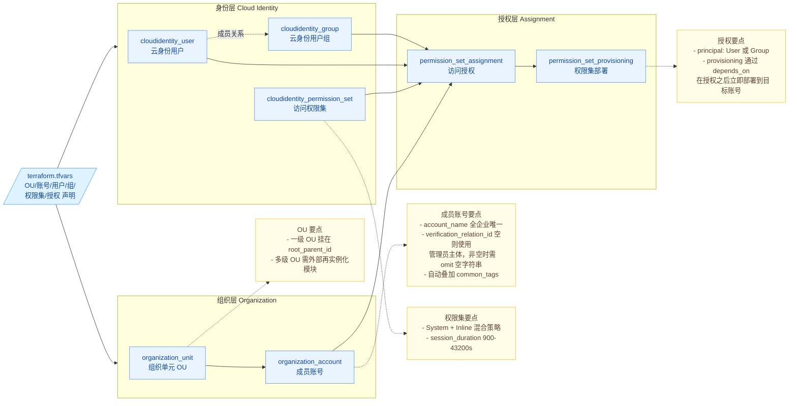

# 火山引擎云身份中心（Cloud Identity）IaC 工程

基于 [volcenginecc](https://registry.terraform.io/providers/volcengine/volcenginecc/latest) Provider 实现"企业组织 + 云身份中心"统一身份治理的 Terraform 工程，覆盖组织树搭建、员工身份生命周期、多账号 SSO 授权全流程。已在火山引擎完成端到端部署验证（16 个资源，3 条访问授权全部 `Provisioned`）。

## 1. 业务背景

随着集团业务多元化，公共云资源使用量爆发增长，企业 IT/安全团队在管理多账号体系与员工身份时面临以下挑战：

- **多账号申请频繁**：业务部门频繁申请新账号，运维需要重复完成"创建账号 → 配置权限初始化"的标准化操作，效率低且易遗漏。
- **员工权限分散**：员工可能需要访问多个火山引擎账号，传统 IAM 模式下需要在每个账号内单独配置 SSO 与角色，授权与回收过程极易产生权限残留。
- **入离转调风险高**：员工生命周期事件（入职、转岗、离职）若依赖人工操作，容易出现"权限过大、回收不全、超期不撤"等合规风险。
- **审计与可追溯性弱**：手工配置缺少版本与审计日志，无法快速回答"为什么这个员工有这个账号的权限"。

火山引擎提供的 **企业组织 + 云身份中心**组合，正是面向集团多账号、多员工治理场景的标准答案：通过企业组织聚合多账号，通过云身份中心集中化管理用户、用户组、权限集，再以"访问授权"将三者编排起来，实现一次配置、多账号生效的 SSO 体系。本工程把这套模型沉淀为可版本化、可复用的 Terraform 工程。

## 2. 方案概述

工程把企业身份治理分成 **三层** 编排：

1. **组织层（Organization）**：构建企业组织 OU 树，按业务线 / 环境隔离创建成员账号。
2. **身份层（Cloud Identity）**：维护云身份中心用户、用户组以及访问权限集模板。
3. **授权层（Assignment）**：把权限集授予用户/组对目标账号的访问能力，并触发权限集到目标账号的部署。

整体架构如下：



### 2.1 核心设计

1. **声明式管理员工生命周期**：在 `terraform.tfvars` 中维护 `cloud_identity_users`、`cloud_identity_groups` 列表。增加条目即入职，移除条目即离职，调整 `member_keys` 即转岗。
2. **权限集承载共性权限**：把"网络运维"、"研发只读"等通用职能预置为 Permission Set，跨账号复用，避免在每个账号内重复配置策略。
3. **稳定的 for_each key**：所有模块均使用业务语义稳定的 key（如 `OU.key`、`account_name`、`user.key`）作为 `for_each` 索引，规避列表顺序变更导致的资源漂移。授权 key 使用 `permission_set_key|principal_type|principal_key|target` 组合，保证幂等。
4. **Assignment 与 Provisioning 联动**：在 [permission-set-assignment](file:///Users/bytedance/Documents/Vibe%20Coding/cloud_identity/modules/permission-set-assignment/main.tf) 模块内，`provisioning` 通过 `depends_on` 显式依赖 `assignment`，确保授权创建后立即把权限集部署到目标账号，用户登录立即可用。
5. **服务端并发限制的代码级规避**：Cloud Control API 对 `CloudIdentity::Group/User/PermissionSet/PermissionSetAssignment` 与 `Organization::Unit/Account` 等资源有服务端并发锁。工程采用"上游哈希 + 阶梯 time_sleep"两层机制：
   - 每个 module 的 `time_sleep.triggers.wait_for` 引用**上一层所有实例聚合成的哈希**，Terraform 图会等待上一层 module 完全结束后本层 sleep 才开始计时（跨 module 引用无 cycle）；
   - 各实例的 `throttle_seconds = 索引 × throttle_step`（默认 `throttle_step = 20`s）阶梯递增，使真实 API 调用按业务 key 排序次序错峰发起。
   
   这样即便部署管道禁止调整 `-parallelism`，同类资源也会自动串行创建。
6. **空 uint64 字段 omit**：`verification_relation_id` 是 uint64 类型，空字符串会触发 `json: invalid use of ,string struct tag` 错误；模块内通过 `var.x == "" ? null : var.x` 兜底，业务侧可放心填空。
7. **安全标签默认化**：[locals.tf](file:///Users/bytedance/Documents/Vibe%20Coding/cloud_identity/locals.tf) 中 `common_tags` 自动注入 `Project / Environment / ManagedBy=terraform`，便于审计与成本分摊。

## 3. IaC 设计

### 3.1 资源清单（实际创建的 7 类共 16 个资源）

| Terraform 资源 | 用途 | 本次实际创建数量 |
| :--- | :--- | :--- |
| `volcenginecc_organization_unit` | 企业组织单元（OU），构建组织树形结构 | 2（Production / Sandbox） |
| `volcenginecc_organization_account` | 组织成员账号，按业务/环境隔离 | 2（workload-prod-01 / sandbox-01） |
| `volcenginecc_cloudidentity_user` | 云身份中心用户，与员工身份一一映射 | 2（alice / bob） |
| `volcenginecc_cloudidentity_group` | 云身份中心用户组，按职能批量授权 | 2（NetOpsTeam / DevReadOnly） |
| `volcenginecc_cloudidentity_permission_set` | 访问权限集模板（System + Inline 策略） | 2（NetworkOpsAdmin / ReadOnlyAccess） |
| `volcenginecc_cloudidentity_permission_set_assignment` | 访问授权（user/group × 权限集 × 目标账号） | 3 |
| `volcenginecc_cloudidentity_permission_set_provisioning` | 把权限集部署到目标账号，自动创建身份供应商与 IAM 角色 | 3 |

> ⚠️ 财务关系（`volcengine_financial_relation`）目前仅在经典 `volcengine` Provider 中提供。本工程严格遵循"仅使用 volcenginecc"的原则，未集成财务关系；如需自动化绑定财务关系，请在企业组织控制台手动操作或单独维护一份经典 Provider 工程。

### 3.2 工程结构

```text
cloud_identity/
├── main.tf                   # 根模块编排：组织 → 身份 → 授权
├── variables.tf              # 输入变量声明（含 OU/账号/用户/组/权限集/授权）
├── outputs.tf                # 关键输出：account_id / user_id / 授权状态
├── locals.tf                 # 通用标签 common_tags
├── providers.tf              # volcenginecc Provider 配置
├── versions.tf               # Terraform 与 Provider 版本约束
├── terraform.tfvars          # 示例：2 OU + 2 账号 + 2 用户 + 2 组 + 2 权限集 + 3 授权
└── modules/
    ├── organization-unit/        # OU 单元封装
    ├── organization-account/     # 成员账号封装（含空 verification_relation_id 兜底）
    ├── cloud-identity-user/      # 云身份用户封装
    ├── cloud-identity-group/     # 云身份用户组封装
    ├── permission-set/           # 访问权限集封装
    └── permission-set-assignment/# 授权 + 部署的原子封装（含 depends_on 编排）
```

### 3.3 核心代码片段

```hcl
# 1. 用 for_each 批量创建 OU，所有 OU 一级挂在 root_parent_id 下
module "organization_units" {
  source   = "./modules/organization-unit"
  for_each = { for ou in var.organization_units : ou.key => ou }

  name        = each.value.name
  description = each.value.description
  parent_id   = var.root_parent_id
}

# 2. 成员账号挂入指定 OU，并自动追加全局标签
module "organization_accounts" {
  source   = "./modules/organization-account"
  for_each = { for acc in var.organization_accounts : acc.account_name => acc }

  account_name             = each.value.account_name
  show_name                = each.value.show_name
  org_unit_id              = each.value.org_unit_key == "" ? var.root_parent_id : module.organization_units[each.value.org_unit_key].org_unit_id
  verification_relation_id = each.value.verification_relation_id
  tags                     = concat(each.value.tags, local.common_tags)
  # ...
}

# 3. 把"权限集 + 用户/组 + 目标账号"组合为一条授权，并立即触发部署
module "permission_set_assignments" {
  source = "./modules/permission-set-assignment"
  for_each = {
    for a in var.permission_set_assignments :
    "${a.permission_set_key}|${a.principal_type}|${a.principal_key}|${a.target_account_key != "" ? a.target_account_key : a.target_account_id}" => a
  }

  permission_set_id = module.permission_sets[each.value.permission_set_key].permission_set_id
  principal_type    = each.value.principal_type
  principal_id = (each.value.principal_type == "User"
    ? module.cloud_identity_users[each.value.principal_key].user_id
    : module.cloud_identity_groups[each.value.principal_key].group_id
  )
  target_id = (each.value.target_account_key != ""
    ? module.organization_accounts[each.value.target_account_key].account_id
    : each.value.target_account_id
  )
}
```

[modules/organization-account/main.tf](file:///Users/bytedance/Documents/Vibe%20Coding/cloud_identity/modules/organization-account/main.tf) 中处理空 uint64 的关键写法：

```hcl
resource "volcenginecc_organization_account" "this" {
  account_name  = var.account_name
  show_name     = var.show_name
  org_unit_id   = var.org_unit_id
  allow_console = var.allow_console
  # 空字符串会被 Provider 解析为 uint64 失败，必须 omit
  verification_relation_id = var.verification_relation_id == "" ? null : var.verification_relation_id
  tags                     = var.tags
}
```

## 4. 使用说明

### 4.1 前置准备

1. **使用企业组织管理员账号**：云身份中心必须由企业组织的管理员账号开通和管理。请确认账号已：
   - 完成企业实名认证；
   - 已开通[企业组织](https://console.volcengine.com/organization/serviceOpen/)；
   - 已开通[云身份中心](https://console.volcengine.com/cloudidentity)。
2. **获取 root_parent_id**：在企业组织控制台 → 组织结构页查看根 OU 的 ID（uint64 数字串），填入 `terraform.tfvars` 的 `root_parent_id`。本次部署使用的是 `7352814720803651635`。
3. **配置 AK/SK 凭证**（推荐环境变量方式，避免硬编码）：

```bash
export VOLCENGINE_ACCESS_KEY="<管理员账号 AK>"
export VOLCENGINE_SECRET_KEY="<管理员账号 SK>"
export VOLCENGINE_REGION="cn-beijing"
```

4. **可选：配置 Provider 国内镜像加速**（编辑 `~/.terraformrc`）：

```hcl
provider_installation {
  network_mirror {
    url     = "https://mirrors.volces.com/terraform/terraformcc/"
    include = ["registry.terraform.io/volcengine/volcenginecc"]
  }
  direct {
    exclude = ["registry.terraform.io/volcengine/volcenginecc"]
  }
}
```

### 4.2 初始化与验证

```bash
cd cloud_identity
terraform init           # 安装 volcenginecc Provider
terraform fmt -recursive # 统一代码风格
terraform validate       # 语法与配置校验
terraform plan           # 预览即将创建的资源
```

### 4.3 部署执行

工程内部已通过 `time_sleep` 阶梯节流机制规避 Cloud Control API 的服务端并发限制，**默认并行度即可稳定 apply**，无需强制 `-parallelism=1`。

```bash
terraform apply -auto-approve
```

如果部署管道禁止修改 `-parallelism`，本工程可直接使用；若你有更紧张的并发预算，可在 [locals.tf](file:///Users/bytedance/Documents/Vibe%20Coding/cloud_identity/locals.tf) 中把 `throttle_step`（单位秒）调大。

部署成功的 outputs 示例（本次实际值）：

```text
organization_unit_ids = {
  "ou_prod"    = "7646683247917580315"
  "ou_sandbox" = "7646647607193206827"
}
organization_account_ids = {
  "sandbox-01"       = "2128394310"
  "workload-prod-01" = "2128394318"
}
cloud_identity_user_ids = {
  "alice" = "119605649410"
  "bob"   = "120220033282"
}
cloud_identity_group_ids = {
  "grp_dev_readonly" = "119203198722"
  "grp_netops"       = "120554878210"
}
permission_set_ids = {
  "ps_network_admin" = "120223103234"
  "ps_readonly"      = "120223102210"
}
permission_set_assignment_status = {
  "ps_network_admin|Group|grp_netops|sandbox-01"       = "Provisioned"
  "ps_network_admin|Group|grp_netops|workload-prod-01" = "Provisioned"
  "ps_readonly|Group|grp_dev_readonly|sandbox-01"      = "Provisioned"
}
```

### 4.4 场景化操作

#### 场景 A：员工入职 / 转岗 / 离职

| 事件 | 操作 |
| :--- | :--- |
| 入职 | `cloud_identity_users` 列表新增条目；将 user.key 加入对应 group 的 `member_keys` |
| 转岗 | 将 user.key 从原 group 的 `member_keys` 移除，加入新 group |
| 离职 | 从 `cloud_identity_users` 删除该条目（Terraform 会自动撤销其在所有 group / assignment 中的关联） |

执行 `terraform plan` 检查变更，再 `terraform apply -parallelism=1` 生效。

#### 场景 B：新增一条多账号 SSO 授权

在 `permission_set_assignments` 列表追加：

```hcl
{
  permission_set_key = "ps_network_admin"
  principal_type     = "Group"
  principal_key      = "grp_netops"
  target_account_key = "workload-prod-01" # 引用本工程创建的成员账号
  target_account_id  = ""                 # 或填入外部已存在账号 ID
}
```

#### 场景 C：发布新权限集

在 `permission_sets` 中新增条目，组合 System 策略与 Inline 策略：

```hcl
{
  key              = "ps_security_audit"
  name             = "SecurityAudit"
  description      = "安全审计员"
  session_duration = 7200
  relay_state      = ""
  permission_policies = [
    { permission_policy_name = "ReadOnlyAccess", permission_policy_type = "System", permission_policy_document = "" },
    { permission_policy_name = "AuditPolicy",   permission_policy_type = "Inline", permission_policy_document = jsonencode({
        Statement = [{ Effect = "Allow", Action = ["actiontrail:*"], Resource = ["*"] }]
      })
    },
  ]
}
```

#### 场景 D：新增成员账号

在 `organization_accounts` 列表追加条目，把 `org_unit_key` 指向已声明的 OU；如果是单主体场景，`verification_relation_id` 留空字符串即可，模块会自动 omit。

### 4.5 常见错误与处理

| 错误信息 | 触发原因 | 处理 |
| :--- | :--- | :--- |
| `trying to unmarshal "REPLACE_..." into uint64` | `root_parent_id` 是占位符 | 替换为真实根 OU ID |
| `trying to unmarshal "" into *uint64` | uint64 字段传了空字符串 | 工程已在 `organization-account` 模块中兜底；若新增 uint64 字段需同样处理 |
| `ConcurrentException: Concurrent request exception` | Cloud Control API 并发限制 | 工程已通过"上游哈希 + 阶梯 time_sleep"规避；如仍偶发，将 `locals.tf` 中 `throttle_step` 由 20 调大到 30/45 即可 |
| Permission Set 重复 plan 显示 `relay_state` 漂移 | 控制台对 relay_state 做了默认值补全 | 在 tfvars 中显式声明你期望的 relay_state；或忽略 plan 中该 in-place update |

### 4.6 销毁资源

```bash
terraform destroy -parallelism=1
```

> ⚠️ `volcenginecc_organization_account` 创建后火山引擎仅支持标记退出而非物理删除，destroy 会从 Terraform state 中移除引用，但实际账号仍存在；销毁后需要在控制台手动处理账号退出流程。

## 5. 总结

本工程把火山引擎"企业组织 + 云身份中心"的最佳实践沉淀成可复用的 Terraform 工程，并在真实账号上完成 16 个资源的端到端部署验证。具备以下优势：

1. **声明式 + 可审计**：员工身份、组织结构、授权关系全部代码化，配合 Git 提供完整的变更历史与回滚能力。
2. **多账号统一治理**：单次配置即可为云身份中心用户授权多个成员账号的 SSO 访问，告别每个账号重复配置 IAM。
3. **零硬编码凭证**：通过环境变量传入 AK/SK，敏感字段标记为 `sensitive`，符合最小权限与机密保护原则。
4. **真实部署验证过的工程**：处理了 Cloud Control API 的实际行为差异（uint64 空值、ConcurrentException、SetNestedAttribute 完整定义），可作为同类场景模板直接复用。
5. **模块化复用**：六个原子模块可独立用于其他工程，例如只想做"批量创建权限集 + 授权"也可单独引用 [permission-set](file:///Users/bytedance/Documents/Vibe%20Coding/cloud_identity/modules/permission-set) 与 [permission-set-assignment](file:///Users/bytedance/Documents/Vibe%20Coding/cloud_identity/modules/permission-set-assignment) 两个模块。

未来可继续扩展：

- 接入企业 HR 系统/CMDB 作为驱动源，自动生成 `terraform.tfvars`；
- 通过 Terraform Cloud / TOS Backend 实现 state 远端集中托管；
- 与 ActionTrail、CLS 联动建立"权限变更 → 日志告警"的安全闭环；
- 当 `volcenginecc` 支持 `financial_relation` 后，把财务关系一并纳入工程。
